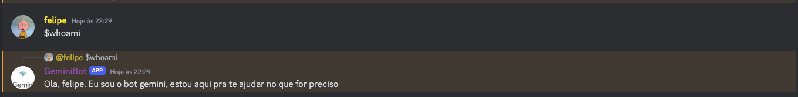
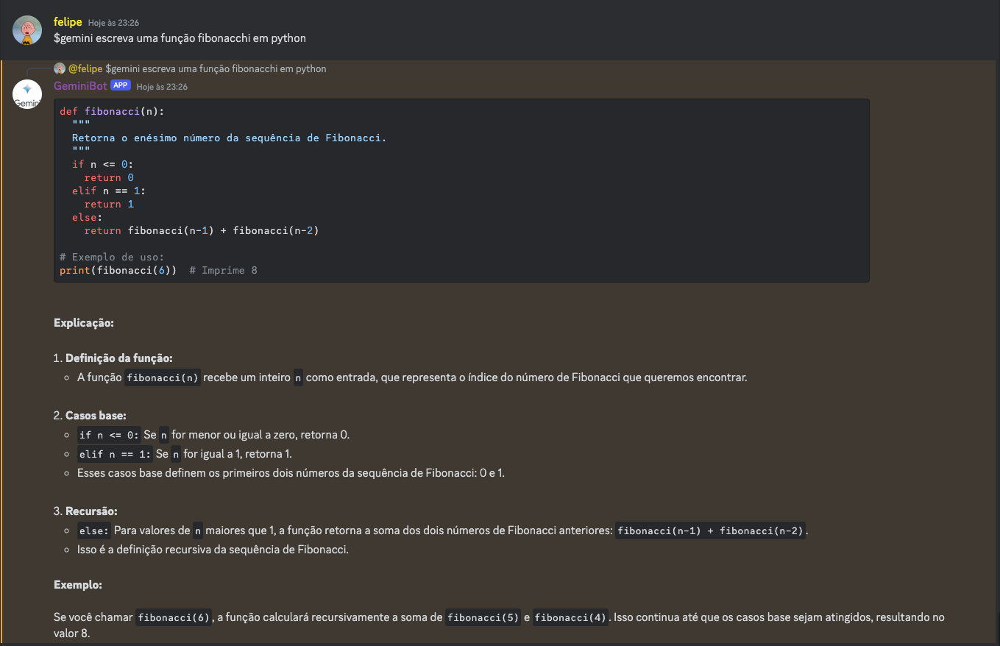

# Gemini Bot

Esse projeto é um bot que facilita o uso da I.A pelo próprio Discord.

Sempre é necessário uma busca por informações fácil e rápida por isso eu pensei em usar utilizar o Gemini no Discord. Sendo possível utilizar e compartilhar o chat com amigos 

# Comandos
Os comando são bem simples, o intuito é ser realmente fácil.
Todos os comandos tem o prefixo $ assim o discord reconhece que se trata de um comando.
- **$whoami**



- **$gemini a sua dúvida**



# Items necessários para usar esse bot
- Docker instalado (se possível saber o básico sobre docker)
- Chave API da [google ai](https://ai.google.dev/)

# Como ativar o bot
### Clone esse repositório
```sh
git clone git@github.com:Fefevs09/Gemini-Bot.git
```
### Inserindo o id e a API
- Abra o editor de código de sua preferencia
- Acesse o arquivo **app/example_constants.py**
- troque o seu nome para **constants.py** 
- Ainda dentro do arquivo substitua os returns pela suas chaves
```python
def get_api_key():
    return "YOUR_API_KEY" # sua api da google ai
def get_id_bot():
    return "YOUR_BOT_ID" # o id do seu bot

```

### Ativando o bot
Graças ao docker você não precisará instalar nada
Abrindo o seu terminal e rode esse comando 
```sh
docker compose up -d 
```

### Pronto o seu bot esta ativo 🎉

# Instalar o Docker
[site oficial docker](https://docs.docker.com/engine/install/)
# Como adicionar um bot no seu próprio servidor?
No próprio site oficial do discord ensina como criar um seu bot
[Como criar um bot no discord](https://discord.com/developers/docs/quick-start/getting-started)

